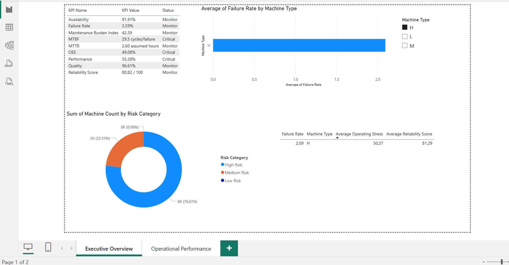
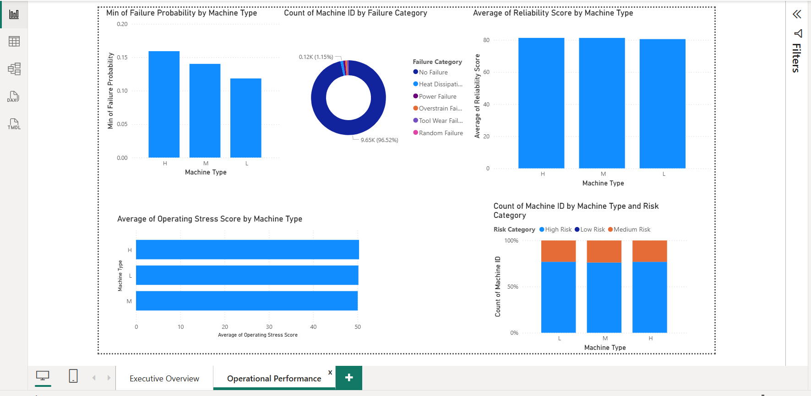

# Industrial Equipment Performance & Maintenance Intelligence Analytics Platform

An end-to-end industrial maintenance analytics project for equipment performance monitoring, failure analysis, KPI tracking, failure risk scoring, and Power BI executive reporting.

This project is designed as a professional analytics initiative for Operations Managers, Maintenance Managers, Reliability Engineers, Plant Supervisors, and Plant Leadership.

## Project Overview

Industrial equipment failures are expensive. They can stop production, increase emergency maintenance work, delay delivery schedules, reduce asset reliability, and make it difficult for leadership to understand where maintenance attention is needed most.

This project transforms raw machine operating data into a complete maintenance intelligence platform using Python, SQLite, SQL, Pandas, Scikit-learn, and Power BI.

The platform answers practical business questions such as:

- Which machine types fail most frequently?
- Which operating conditions are most associated with failure?
- Does tool wear increase failure likelihood?
- Which failure categories create the highest maintenance burden?
- Which machines should receive preventive maintenance priority?
- What KPIs should leadership monitor?
- Which machines are High Risk based on failure probability and reliability score?

## Business Problem

Maintenance teams often work reactively. They respond after equipment failure has already occurred. This creates:

- Unplanned downtime
- Emergency repair cost
- Production delays
- Poor maintenance prioritization
- Limited visibility into machine health
- Higher operational risk

This project solves that problem by creating a structured analytics platform that supports proactive maintenance planning and executive decision making.

## Business Value

The project helps manufacturing teams:

- Monitor equipment health using maintenance KPIs
- Identify machine types with higher failure exposure
- Detect risky operating conditions
- Prioritize High Risk machines for inspection
- Understand failure categories and maintenance burden
- Use Power BI dashboards for leadership reporting
- Move from reactive maintenance reporting to proactive maintenance intelligence

## Project Highlights

| Metric | Value |
|---|---:|
| Dataset Size | 10,000 machine records |
| Original Dataset Features | 14 features |
| Database Architecture | 3 layers |
| Power BI Reporting Datasets | 4 datasets |
| Maintenance KPIs Implemented | 9 KPIs |
| Risk Model Accuracy | 85.76% |
| Risk Model Recall | 81.18% |
| Risk Model ROC-AUC | 91.42% |
| Dashboard Visual Pages Saved | 2 pages |

The Logistic Regression failure risk model achieved **85.76% accuracy** and **91.42% ROC-AUC**. Since this is a maintenance risk project, Recall is especially important; the model achieved **81.18% recall**, helping reduce the chance of missing actual failure cases.

## Dataset

**Dataset:** AI4I 2020 Predictive Maintenance Dataset

The dataset contains simulated industrial equipment observations with:

- Product ID
- Machine type
- Air temperature
- Process temperature
- Rotational speed
- Torque
- Tool wear
- Machine failure flag
- Failure mode indicators:
  - TWF: Tool Wear Failure
  - HDF: Heat Dissipation Failure
  - PWF: Power Failure
  - OSF: Overstrain Failure
  - RNF: Random Failure

## Tech Stack

| Area | Tools |
|---|---|
| Programming | Python |
| Data Processing | Pandas, NumPy |
| Database | SQLite |
| Querying | SQL |
| Machine Learning / Risk Scoring | Scikit-learn, Logistic Regression |
| Visualization and Reporting | Power BI |
| Documentation | Markdown |

## End-to-End Architecture

```text
AI4I 2020 Dataset
        |
        v
Python Data Ingestion
        |
        v
SQLite Database: maintenance.db
        |
        +--> machine_raw
        +--> machine_clean
        +--> machine_analytics
        |
        v
SQL Analytics Layer
        |
        v
Data Cleaning and Transformation
        |
        v
Business-Focused EDA
        |
        v
KPI Analytics Framework
        |
        v
Failure Risk Scoring Engine
        |
        v
Power BI Export Layer
        |
        v
Power BI Dashboard
        |
        v
Executive Reporting and Maintenance Recommendations
```

## Project Layers Implemented

| Layer | Description |
|---|---|
| Layer 1 | Data ingestion and SQLite database architecture |
| Layer 2 | SQL analytics, KPI queries, and reusable views |
| Layer 3 | Data cleaning and transformation notebook |
| Layer 4 | Business-focused exploratory data analysis notebook |
| Layer 5 | KPI analytics notebook |
| Layer 6 | Failure risk scoring engine using Logistic Regression |
| Layer 7 | Power BI export layer |
| Layer 8 | Power BI dashboard design |
| Layer 9 | Executive summary |
| Layer 10 | Interview preparation guide |

## Key Features

### Data Ingestion and Validation

- CSV validation
- Column validation
- Data type validation
- Duplicate checks
- SQLite transaction management
- Logging and error handling

### Database Architecture

The project uses three core SQLite tables:

| Table | Purpose |
|---|---|
| `machine_raw` | Preserves source data for auditability |
| `machine_clean` | Stores validated, typed records for trusted analysis |
| `machine_analytics` | Stores engineered features for KPIs, EDA, risk scoring, and Power BI |

### SQL Analytics Layer

Includes production-style SQL for:

- Failure Rate by Machine Type
- Failure Count by Failure Category
- Average Tool Wear Before Failure
- Failed vs Non-Failed Torque Analysis
- Temperature Difference Impact Analysis
- Operating Stress Analysis
- High Risk Machine Identification
- Maintenance Burden Analysis
- KPI calculations
- Power BI-ready views

### Data Cleaning Framework

The cleaning notebook covers:

- Dataset overview
- Missing value assessment
- Duplicate analysis
- Data type validation
- Outlier analysis
- Feature consistency checks
- Clean dataset creation
- Data quality summary

Important decision: outliers are not automatically removed because industrial outliers may represent real high-risk operating conditions.

### Feature Engineering

Engineered features include:

- Temperature Difference
- Mechanical Power
- Tool Wear Risk Category
- Operating Stress Score
- Failure Count
- Primary Failure Mode

### Business-Focused EDA

The EDA notebook is designed for maintenance and operations decision making. It answers:

- Which machine type fails most frequently?
- Which operating conditions are associated with failures?
- Does tool wear increase failure likelihood?
- Which failure category creates the highest maintenance burden?
- Which stress profiles create the highest risk?
- Which machine groups should receive preventive maintenance priority?
- What early warning patterns appear before failures?

## KPI Framework

| KPI | Formula / Logic | Business Meaning |
|---|---|---|
| Failure Rate | `Total Failures / Total Observations` | Measures baseline reliability |
| Failure Rate by Machine Type | `Failures by Type / Observations by Type` | Identifies risky machine categories |
| MTBF Proxy | `Total Observations / Total Failures` | Estimates observations between failures |
| MTTR Proxy | `Assumed Repair Hours / Failures` | Estimates repair burden |
| Availability Proxy | `MTBF / (MTBF + MTTR)` | Estimates equipment readiness |
| Performance Index | Speed, power, and stress-based score | Measures operating effectiveness |
| Quality Proxy | `Non-Failure Observations / Total Observations` | Measures failure-free operation |
| OEE Proxy | `Availability x Performance x Quality` | Executive equipment effectiveness indicator |
| Reliability Score | Weighted 0-100 score | Ranks machine health |
| Maintenance Burden Index | Failure, repair, and stress-based index | Estimates workload pressure |

## Important KPI Assumptions

The AI4I dataset does not include actual downtime, repair duration, production output, or defect counts.

Therefore:

- MTBF is an observation-based proxy.
- MTTR uses documented repair-time assumptions by failure category.
- Availability is a proxy based on MTBF and MTTR.
- Performance is based on speed, mechanical power, and stress.
- Quality is based on failure-free observations.
- OEE is a decision-support proxy, not certified plant OEE.

These assumptions are documented clearly so the analysis remains transparent and business-safe.

## Failure Risk Scoring Engine

The risk scoring engine uses Logistic Regression to estimate machine failure probability.

### Why Logistic Regression?

Logistic Regression was selected because:

- It is interpretable.
- It provides probability outputs.
- It is suitable for business risk scoring.
- It helps explain which features increase failure risk.

### Model Inputs

- Air Temperature
- Process Temperature
- Temperature Difference
- Rotational Speed
- Torque
- Tool Wear
- Mechanical Power
- Operating Stress Score
- Machine Type

### Model Outputs

- Failure Probability
- Risk Category:
  - Low Risk
  - Medium Risk
  - High Risk
- Recommended Maintenance Action

### Evaluation Metrics

The notebook evaluates:

- Accuracy
- Precision
- Recall
- F1 Score
- ROC-AUC
- Confusion Matrix
- ROC Curve

## Power BI Dashboard

Dashboard title:

**Industrial Equipment Performance & Maintenance Intelligence Dashboard**

The dashboard supports:

- Equipment performance monitoring
- Failure analysis
- KPI tracking
- Risk prioritization
- Maintenance recommendations

### Dashboard Pages

| Page | Purpose |
|---|---|
| Executive Overview | Leadership KPI summary and reliability health |
| Operational Performance | Tool wear, torque, temperature, mechanical power, and stress analysis |
| Maintenance Risk Intelligence | High Risk machines, failure probability, risk categories, and reliability score |
| Recommendations & Action Plan | Priority matrix, recommended actions, KPI status, and expected business impact |

## Dashboard Screenshots

### Executive Overview



### Operational / Risk View



## Power BI Export Files

The export script creates dashboard-ready CSV datasets:

| Export File | Purpose |
|---|---|
| `machine_dashboard_dataset.csv` | Main machine-level dashboard dataset |
| `kpi_summary.csv` | Executive KPI scorecard |
| `risk_summary.csv` | Risk category distribution |
| `machine_type_summary.csv` | Machine type performance and reliability summary |

Default export location:

```text
powerbi/data_exports/
```

## Project Structure

```text
Industrial Equipment Performance & Maintenance Intelligence Analytics Platform/
|-- README.md
|-- requirements.txt
|-- data/
|   |-- raw/
|   |-- processed/
|   |-- database/
|-- docs/
|   |-- architecture_diagram.md
|   |-- data_flow_design.md
|   |-- database_design.md
|   |-- sql_layer_documentation.md
|   |-- interview_preparation.md
|-- notebooks/
|   |-- 01_data_cleaning.ipynb
|   |-- 02_business_eda.ipynb
|   |-- 03_kpi_analysis.ipynb
|   |-- 04_risk_scoring.ipynb
|-- powerbi/
|   |-- dashboard_design.md
|   |-- dashboards/
|   |-- data_exports/
|-- reports/
|   |-- executive_summary.md
|   |-- interview_preparation.md
|-- scripts/
|   |-- export_powerbi.py
|-- sql/
|   |-- ddl/
|   |   |-- create_tables.sql
|   |-- queries/
|   |   |-- business_queries.sql
|   |   |-- kpi_queries.sql
|   |-- views/
|   |   |-- analytics_views.sql
|-- src/
|   |-- data_ingestion/
|   |   |-- ingest_data.py
|   |-- database/
|   |   |-- database_manager.py
|-- artifacts/
|   |-- visuals/
|   |   |-- dashboard_page1.png
|   |   |-- dashboard_page2.png
```

## How to Run the Project

### 1. Clone the Repository

```bash
git clone <your-repository-url>
cd "Industrial Equipment Performance & Maintenance Intelligence Analytics Platform"
```

### 2. Create a Virtual Environment

```bash
python -m venv venv
venv\Scripts\activate
```

### 3. Install Dependencies

```bash
pip install -r requirements.txt
```

### 4. Add the Dataset

Place the AI4I 2020 Predictive Maintenance CSV file in:

```text
data/raw/
```

Recommended filename:

```text
ai4i2020.csv
```

### 5. Run Data Ingestion

```bash
python src/data_ingestion/ingest_data.py --csv-path data/raw/ai4i2020.csv
```

This creates:

```text
data/database/maintenance.db
```

### 6. Run SQL Views

Use any SQLite client or command line to run:

```bash
sqlite3 data/database/maintenance.db < sql/views/analytics_views.sql
```

### 7. Run Notebooks

Open and run:

```text
notebooks/01_data_cleaning.ipynb
notebooks/02_business_eda.ipynb
notebooks/03_kpi_analysis.ipynb
notebooks/04_risk_scoring.ipynb
```

### 8. Export Power BI Datasets

```bash
python scripts/export_powerbi.py
```

Exports will be created in:

```text
powerbi/data_exports/
```

### 9. Open Power BI

Import the exported CSV files into Power BI:

- `machine_dashboard_dataset.csv`
- `kpi_summary.csv`
- `risk_summary.csv`
- `machine_type_summary.csv`

## Key Business Insights

The platform is designed to identify:

- Machine types with higher failure rates
- Failure categories creating maintenance burden
- High tool wear segments
- Stress profiles linked with elevated risk
- Machines with low reliability score
- High Risk observations requiring preventive maintenance attention

## Maintenance Recommendations

The project recommends:

- Create a High Risk machine watchlist.
- Prioritize machine types with above-baseline failure rates.
- Monitor high tool wear categories.
- Review high torque and mechanical power conditions.
- Track operating stress score as an early warning signal.
- Use KPI status to guide leadership review.
- Use Power BI dashboards in weekly maintenance planning.
- Add real downtime and repair duration data in future production use.

## Documentation Included

| Document | Purpose |
|---|---|
| [How to Run Project](docs/how_to_run_project.md) | Step-by-step guide to run ingestion, SQL views, notebooks, exports, and Power BI refresh |
| [Assumptions and Limitations](docs/assumptions_and_limitations.md) | Explains KPI proxies, dataset limitations, and production assumptions |
| [Executive Summary](reports/executive_summary.md) | Leadership-facing summary of business problem, findings, recommendations, and impact |
| [Database Design](docs/database_design.md) | Explains SQLite table architecture |
| [SQL Layer Documentation](docs/sql_layer_documentation.md) | Explains SQL analytics layer |
| [Power BI Dashboard Design](powerbi/dashboard_design.md) | Power BI dashboard design specification |

## Limitations

The project uses a simulated dataset. It does not contain:

- Real downtime logs
- Repair start and end timestamps
- Actual repair duration
- Production output
- Defect or scrap data
- Work order history
- Real-time sensor streams

Because of this, MTBF, MTTR, Availability, Performance, Quality, and OEE are documented as analytical proxies.

## Future Scope

Potential production improvements:

- Migrate SQLite to PostgreSQL or cloud warehouse
- Add IoT sensor streaming
- Integrate CMMS work orders
- Add real downtime and repair duration
- Persist model scores into the database
- Schedule automatic exports
- Enable Power BI scheduled refresh
- Add alerting for High Risk machines
- Deploy model scoring as an API

## Portfolio Highlights

This project demonstrates:

- Data analytics project design
- SQL database architecture
- Data quality validation
- Business-focused EDA
- KPI analytics
- Interpretable risk scoring
- Power BI reporting design
- Executive communication
- Manufacturing analytics domain understanding

## Responsible Analytics Note

This project is a decision-support analytics platform. Risk scores and KPI proxies should support maintenance review, not replace engineering judgment. In a production environment, assumptions should be validated with real plant data, maintenance teams, and reliability engineers.
