# Architecture Diagram

## Industrial Equipment Performance & Maintenance Intelligence Analytics Platform

```mermaid
flowchart LR
    A["AI4I 2020 Predictive Maintenance Dataset"] --> B["Raw Data Storage"]
    B --> C["Python Data Ingestion Layer"]
    C --> D["Data Cleaning & Validation"]
    D --> E["Feature Engineering Layer"]
    E --> F["SQLite Analytics Database"]
    F --> G["SQL Views & KPI Queries"]
    G --> H["Exploratory Analytics"]
    G --> I["Machine Learning Pipeline"]
    I --> J["Model Evaluation & Maintenance Risk Scores"]
    G --> K["Power BI Semantic Layer"]
    J --> K
    K --> L["Power BI Maintenance Intelligence Dashboard"]
    L --> M["Operations, Reliability & Maintenance Decision Support"]
```

## Architecture Layers

| Layer | Purpose |
|---|---|
| Source Data | Provides equipment operating conditions, failure labels, and machine metadata. |
| Raw Data Storage | Preserves the original dataset before transformation. |
| Ingestion Layer | Loads source data into the project environment. |
| Cleaning & Validation | Handles missing values, data types, duplicate checks, and business-rule validation. |
| Feature Engineering | Creates analytical and model-ready features from sensor and operating data. |
| SQLite Database | Stores cleaned data, engineered features, and analytical tables. |
| SQL Analytics Layer | Provides reusable KPI queries, views, and reporting-ready extracts. |
| Machine Learning Layer | Trains and evaluates predictive maintenance models. |
| BI Layer | Connects Power BI to curated tables, KPIs, and prediction outputs. |
| Decision Support | Enables maintenance prioritization, performance tracking, and operational insight. |

## Planned Platform Outputs

- Equipment performance KPIs
- Failure mode analysis
- Maintenance risk indicators
- Predictive failure classification
- Model performance metrics
- Power BI dashboard views for executive and operational users

