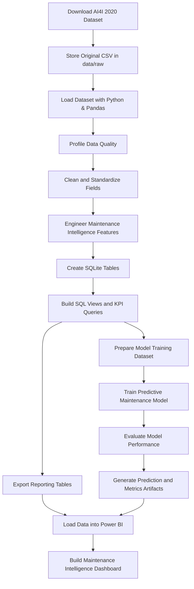
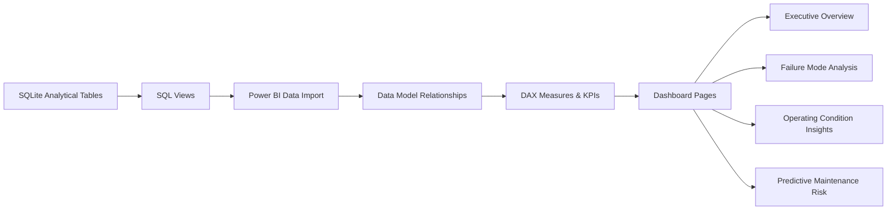

# Data Flow Design

## End-to-End Data Flow

## Data Flow Stages

| Stage | Input | Process | Output |
|---|---|---|---|
| 1. Data Acquisition | AI4I 2020 dataset | Download and preserve original source data | Raw CSV file |
| 2. Data Ingestion | Raw CSV | Load with Pandas | Initial dataframe |
| 3. Data Profiling | Initial dataframe | Review schema, distributions, nulls, duplicates, and failure balance | Data quality summary |
| 4. Data Cleaning | Profiled dataset | Standardize columns, validate values, prepare consistent data types | Cleaned dataset |
| 5. Feature Engineering | Cleaned dataset | Create temperature difference, wear-risk, load-risk, and operating-condition indicators | Feature table |
| 6. Database Loading | Cleaned and feature datasets | Store tables in SQLite | SQLite analytics database |
| 7. SQL Analytics | SQLite tables | Create KPI queries, views, and reporting extracts | Analytical SQL outputs |
| 8. Model Preparation | Feature table | Split data, define target, prepare model-ready features | Training and test datasets |
| 9. Model Training | Model-ready data | Train classification model using Scikit-learn | Predictive maintenance model |
| 10. Model Evaluation | Predictions and labels | Evaluate precision, recall, F1-score, ROC-AUC, and confusion matrix | Model performance report |
| 11. BI Preparation | SQL outputs and model artifacts | Prepare Power BI-ready tables | Reporting dataset |
| 12. Dashboarding | Reporting dataset | Build Power BI visuals and KPI pages | Maintenance intelligence dashboard |

## Planned Data Entities

| Entity | Description |
|---|---|
| equipment_observations | Core machine operating records from the dataset. |
| failure_events | Failure labels and failure mode indicators. |
| engineered_features | Derived analytical and machine learning features. |
| maintenance_kpis | Aggregated metrics for reporting and dashboarding. |
| model_predictions | Predicted failure risk and classification outputs. |
| model_metrics | Evaluation metrics for model governance and review. |

## Planned Power BI Data Flow

## Data Quality Controls

- Validate expected columns and data types
- Check duplicate records
- Confirm target class distribution
- Validate numeric ranges for temperature, speed, torque, and tool wear
- Preserve raw data separately from processed data
- Document transformations before modeling or dashboarding

