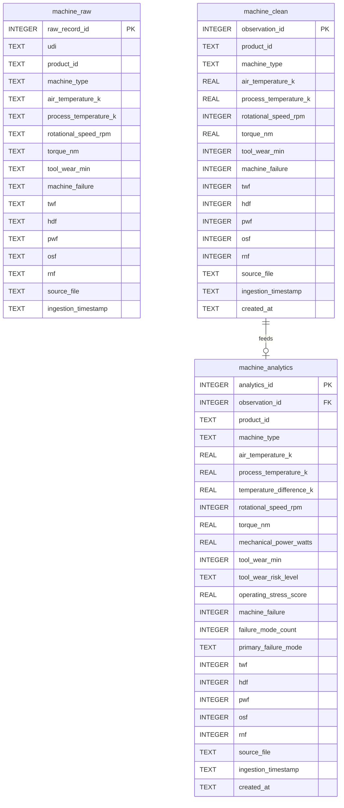
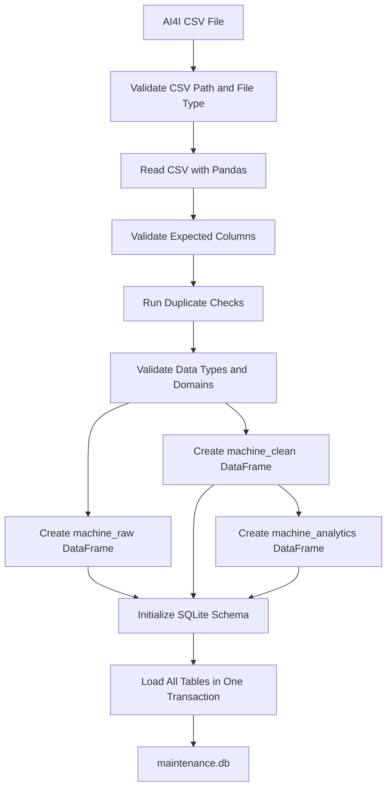

# Database Design

## Layer 1: Data Ingestion and Database Architecture

This layer creates the SQLite foundation for the Industrial Equipment Performance & Maintenance Intelligence Analytics Platform. It ingests the AI4I 2020 Predictive Maintenance Dataset, validates it, and stores it in a structured database named `maintenance.db`.

## Database

| Item | Design |
|---|---|
| Database engine | SQLite |
| Database file | `data/database/maintenance.db` |
| DDL script | `sql/ddl/create_tables.sql` |
| Ingestion script | `src/data_ingestion/ingest_data.py` |
| Database utility | `src/database/database_manager.py` |

## Source Dataset

The ingestion layer expects the AI4I 2020 Predictive Maintenance Dataset with the following source columns:

| Source Column | Description |
|---|---|
| UDI | Unique observation identifier. |
| Product ID | Product or machine identifier from the source dataset. |
| Type | Product quality or machine type category: `L`, `M`, or `H`. |
| Air temperature [K] | Ambient air temperature in Kelvin. |
| Process temperature [K] | Process temperature in Kelvin. |
| Rotational speed [rpm] | Machine rotational speed in revolutions per minute. |
| Torque [Nm] | Torque in Newton meters. |
| Tool wear [min] | Tool wear duration in minutes. |
| Machine failure | Binary target flag for machine failure. |
| TWF | Tool Wear Failure flag. |
| HDF | Heat Dissipation Failure flag. |
| PWF | Power Failure flag. |
| OSF | Overstrain Failure flag. |
| RNF | Random Failure flag. |

## Table Architecture



## Why Each Table Exists

### `machine_raw`

`machine_raw` preserves the dataset as close to the incoming CSV as practical while using consistent database column names. All source measurement and flag fields are stored as text so the platform keeps a raw ingestion record before type conversion.

This table exists to support:

- Auditability of the original source data
- Reconciliation between raw CSV records and cleaned records
- Troubleshooting ingestion or transformation issues
- Evidence that validation and transformation were performed after landing the data

### `machine_clean`

`machine_clean` stores validated, typed, analysis-safe observations. It enforces core data quality rules through column types, primary keys, uniqueness rules, and check constraints.

This table exists to support:

- Reliable SQL analysis on clean numeric fields
- Consistent joins and filtering by observation, product, machine type, and failure flag
- Downstream feature engineering
- Power BI imports that need stable field names and types

### `machine_analytics`

`machine_analytics` stores derived features and reporting-ready maintenance intelligence fields. It includes engineered values such as temperature difference, mechanical power, tool wear risk, operating stress score, failure mode count, and primary failure mode.

This table exists to support:

- KPI calculation
- Exploratory analysis
- Power BI dashboarding
- Predictive maintenance feature preparation
- Business-friendly segmentation of maintenance risk

## Validation Controls

The ingestion layer performs the following checks before loading data:

| Validation | Purpose |
|---|---|
| CSV validation | Confirms the input exists, is a file, has a `.csv` extension, and is not empty. |
| Column validation | Confirms the source columns exactly match the expected AI4I 2020 schema. |
| Data type validation | Converts numeric fields and rejects non-numeric values in numeric columns. |
| Null validation | Rejects records with missing values. |
| Duplicate checks | Rejects duplicate full rows, duplicate `UDI`, and duplicate `Product ID` values. |
| Domain validation | Confirms machine type values are `L`, `M`, or `H`. |
| Binary flag validation | Confirms failure and failure-mode columns contain only `0` or `1`. |
| Range validation | Confirms temperatures, speed, torque, and tool wear values are within valid numeric ranges. |
| Failure consistency review | Logs rows where the aggregate `machine_failure` flag and detailed failure-mode flags do not align. These are not rejected because the AI4I dataset is known to contain some label inconsistencies that should remain available for analysis. |

## Transaction Management

All table loads are executed inside one explicit SQLite transaction. If any insert fails, the transaction is rolled back and no partial dataset is committed.

The database manager also enables:

- Foreign key enforcement
- Write-ahead logging through SQLite WAL mode
- Atomic replacement or append loading
- Centralized error handling for database failures

## Ingestion Flow



## Operational Usage

After placing the AI4I CSV file in `data/raw`, run ingestion from the project root:

```bash
python src/data_ingestion/ingest_data.py --csv-path data/raw/ai4i2020.csv
```

By default, the script creates or updates:

```text
data/database/maintenance.db
```

To append instead of replacing existing table rows:

```bash
python src/data_ingestion/ingest_data.py --csv-path data/raw/ai4i2020.csv --append
```
